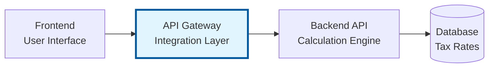

# Master Prompt for System Documentation - MuleSoft API Gateway

> **Purpose**: This document contains the master prompt used to generate or update `docs/system-overview.md`.  
> **Usage**: Use this prompt when creating comprehensive system documentation or when major architectural changes require documentation updates.  
> **Last Updated**: `2025-12-29`  
> **Scope**: **API Gateway** (integration layer) - one of three components in the NettoApi system

---

## Philosophy

**Documentation should explain WHY the system is built as it is, not catalog every implementation detail.**

- Focus on architectural decisions and trade-offs
- Document flows and interactions, not exact implementations
- Keep concepts stable, let code be the source of truth for details
- Reference code files for specifics (versions, schemas, configurations)

---

## Documentation Scope

### What This Document Covers

This master prompt generates documentation for the **API Gateway** component only. The documentation should:

| Aspect | Coverage Level |
|--------|---------------|
| **Gateway architecture** | Full detail - three-tier API layers |
| **Request/Response flows** | Full detail - routing, transformation |
| **RAML contracts** | Full detail - API specifications |
| **System context** | Brief overview - how gateway fits in larger system |
| **Backend API** | Context only - mention role, reference integration guide |
| **Frontend** | Context only - mention role, not implementation |

### Cross-Project References

Each component has its own documentation:
- **Backend API**: (separate repository with own documentation)
- **API Gateway** (this project): `.github/` and `docs/`
- **Frontend**: (separate repository with own documentation)

The system overview diagram appears in all three projects for context, but detailed documentation lives in each respective project.

---

## Overview

You are tasked with creating high-level system documentation for **NettoApi Gateway** - a MuleSoft API Gateway for the Swedish salary and tax calculator system.  
Generate or update a `docs/system-overview.md` file that remains stable over time by focusing on architectural concepts rather than implementation details.

### Gateway Purpose

The API Gateway serves as the integration layer between external clients (Frontend) and the Backend API. It implements MuleSoft's API-led connectivity pattern with three API layers:

1. **Experience API** - Public entry point, request validation, response transformation
2. **Process API** - Orchestration, aggregation, sequencing
3. **System API** - Backend integration, protocol translation

The gateway does NOT contain business logic - all calculations are performed by the Backend API.

### System Architecture Overview

> **Note**: This section provides context for how the API Gateway fits into the larger system. 
> Detailed documentation for Backend API and Frontend lives in their respective repositories.

The system consists of three main components designed with enterprise-grade separation of concerns:



| Component | Responsibility | Documentation |
|-----------|---------------|---------------|
| **Backend API** | Centralized calculation and business logic. All tax rules, percentages, and assumptions reside here. | Separate repository |
| **API Gateway** (this project) | Integration layer between frontend and backend. Provides stable, user-facing API contracts. | **This repository** |
| **Frontend** | Input collection and result presentation. Basic validation only. No business logic. | Separate repository |

### Key Design Principles

- **Gateway as integration layer**: No business logic in gateway
- **API-led connectivity**: Three-tier API architecture
- **Backend as source of truth**: All calculations in Backend API
- **Stable API contracts**: RAML-defined interfaces
- **Enterprise-inspired architecture**: Demonstrates MuleSoft patterns

---

## Required Sections

### 1. System Overview
- Brief description of the gateway's purpose
- Role in the larger system
- Key capabilities (routing, validation, transformation)

### 2. Architecture Overview
- High-level architecture diagram (Mermaid)
- Three-tier API architecture explanation
- Layer descriptions and responsibilities
- Why this pattern was chosen

### 3. Technology Stack
**Focus on choices and rationale, not versions**
- MuleSoft Runtime
- APIKit for RAML validation
- HTTP Connectors
- DataWeave for transformations
- **Note**: For specific versions, reference `pom.xml`

### 4. API Layers
**Focus on responsibilities and boundaries**

For each layer:
- Layer name and purpose
- Responsibilities and boundaries
- Key flows
- What it does NOT do

**What to include:**
- High-level flow responsibilities
- Layer interactions
- Separation of concerns

**What to avoid:**
- Exact XML configurations
- Every flow detail
- Implementation specifics

### 5. Data Flow & Key Scenarios
**Focus on interactions, not implementation**

- Salary calculation flow (Mermaid sequence diagram)
- Request validation flow
- Error handling approach

**What to include:**
- Sequence diagrams for key flows
- How layers interact
- Error propagation

### 6. Integration with Backend API

- Reference to [`docs/mulesoft-integration-guide.md`](../docs/mulesoft-integration-guide.md)
- Key endpoints used
- Request/Response transformation approach
- Error handling from backend

### 7. Key Design Decisions & Trade-offs

For major decisions, document:
- The decision that was made
- Alternatives considered
- Rationale for the choice
- Trade-offs and limitations

**Examples:**
- "Why three-tier API architecture?"
- "Why no business logic in gateway?"
- "Why RAML for API contracts?"

### 8. RAML Contracts

- Overview of API contract approach
- Key types defined
- Error response standards
- Reference actual RAML files for details

### 9. Configuration & Deployment

- Configuration approach (`config.properties`)
- Environment-specific settings
- Port assignments (8081, 8082, 8083)
- Reference actual config files for details

### 10. Known Limitations & Technical Debt

- Current architectural limitations
- Planned improvements
- Trade-offs that affect functionality

### 11. Glossary

- MuleSoft-specific terms
- API-led connectivity concepts
- Gateway terminology

---

## Sections NOT Required

The following sections are **NOT needed** as they create maintenance burden:

- ❌ **Detailed XML Configuration** - Code is source of truth
- ❌ **Every DataWeave Transformation** - Code is source of truth
- ❌ **Deployment Pipeline Steps** - CI/CD configs are source of truth
- ❌ **Environment Setup** - README.md handles this
- ❌ **Complete Flow Listings** - Code is source of truth

**Instead, reference the actual files** where this information lives.

---

## Documentation Guidelines

### Content Quality
- **Use Mermaid diagrams extensively** for visual clarity
- **Keep language clear and concise** - avoid jargon when possible
- **Focus on "why" decisions were made**, not just "what" exists
- **Reference actual code files** for implementation details
- **Update the "Last Updated" date** at the top
- **Add a changelog** for tracking major updates

### The "Stability Test"
Before adding detail, ask: **"Will this still be true in 6 months?"**

- ✅ "Experience API validates requests against RAML" - stable concept
- ❌ "Experience API uses port 8081" - might change
- ✅ "Gateway does not contain business logic" - architectural principle
- ❌ "The transform uses `payload.municipality_id`" - implementation detail

---

## Example Structure

```markdown
# NettoApi Gateway - System Overview

> **Component**: API Gateway (Integration Layer)  
> **Last Updated**: 2025-12-29

## Purpose

Brief description of gateway role...

## Architecture

### System Context

[Mermaid diagram showing all three components]

### Three-Tier API Architecture

[Mermaid diagram showing Experience → Process → System layers]

## API Layers

### Experience API
- Purpose, responsibilities, what it doesn't do

### Process API
- Purpose, responsibilities, what it doesn't do

### System API
- Purpose, responsibilities, what it doesn't do

## Key Flows

### Salary Calculation

[Mermaid sequence diagram]

## Integration

Reference to mulesoft-integration-guide.md...

## Design Decisions

### Why Three-Tier Architecture?
Decision, alternatives, rationale, trade-offs...

## Glossary

Terms and definitions...
```

---

*Last Updated: 2025-12-29*
